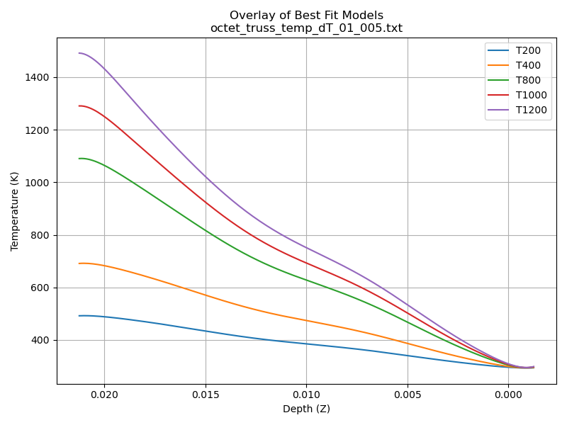

# 🌞 COMSOL Temperature Data Analyzer for Solar Simulation Lab

This repository contains Python notebooks for processing `.txt` files exported from **COMSOL Multiphysics**. It is specifically designed for the **Solar Simulation & Heat Transfer Lab**, where thermal data is analyzed across different depths in a material.

## 📈 Overview

The notebooks:

- Parse and organize temperature data by **depth**
- Compute:
  - Average temperature per depth
  - Average temperature change (ΔT) per depth
- Fit both **polynomial** and **logarithmic** models to the data
- Compare model performance using **R² (coefficient of determination)**
- Generate **graphs** for visualization and reporting

All analysis is performed using **Jupyter Notebooks** with an emphasis on clarity and automation for lab reporting.

---

## 🗂 File Structure

```
📁 your-repo/
├── notebook_avg_temp.ipynb       # Average Temperature vs Depth
├── notebook_avg_dT.ipynb         # ΔT (Temperature Change) vs Depth
├── data/
│   └── *.txt                     # Raw COMSOL data files
├── images/
│   ├── overlay_best_fit.png      # Plot of best-fit models (Temperature)
│   └── Toverlay_best_fit.png     # Plot of best-fit models (ΔT)
└── README.md
```

---

## 🔧 Requirements

Make sure you have the following Python packages installed:

```python
import pandas as pd
import matplotlib.pyplot as plt
import numpy as np
from sklearn.metrics import r2_score
from scipy.optimize import curve_fit
```

Install them with:

```bash
pip install pandas matplotlib numpy scikit-learn scipy
```

---

## 📊 Example Output Plots

### 🔹 Temperature vs Depth – Best Fit Overlay



---


## 💡 How to Use

1. Place your `.txt` files from COMSOL into the `data/` directory.
2. Open either notebook:
   - `notebook_avg_temp.ipynb` for average temperature
   - `notebook_avg_dT.ipynb` for average temperature change (ΔT)
3. Run the cells to:
   - Load and process data
   - Fit models
   - Generate and save plots

All results (including R² scores and model parameters) are displayed and plotted for use in lab reports or further research.

---
